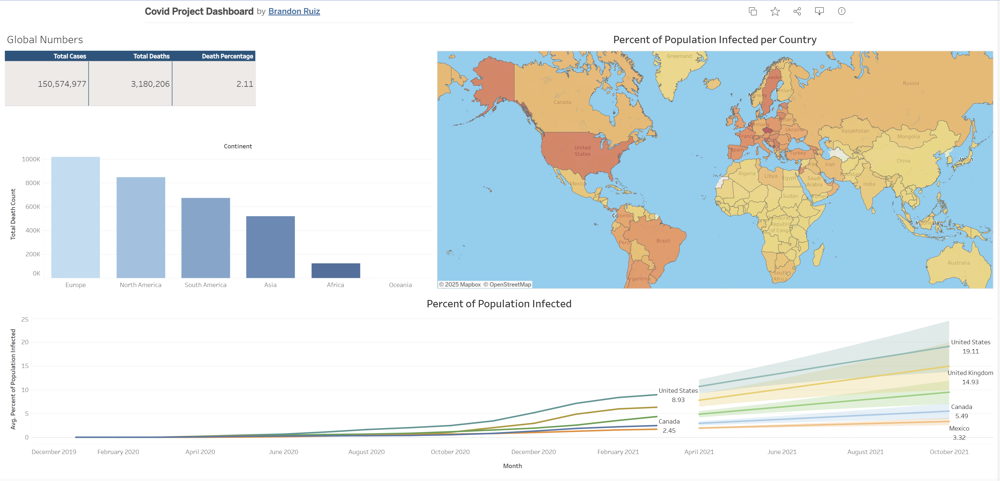

# 🦠 COVID‑19 SQL Dashboard

This project transforms raw COVID‑19 data into an interactive dashboard using SQL‑driven metrics and Excel visualizations. It highlights advanced SQL querying, data modeling, and dashboard design to uncover trends in cases, deaths, and vaccination progress across regions.

---

## 🔧 Tools Used
- SQL (CTEs, window functions, joins)
- Excel (Pivot Tables, Charts, Dashboarding)
- Data Cleaning & Transformation

---

## 📊 Dashboard Preview

---

## 📁 Project Structure
